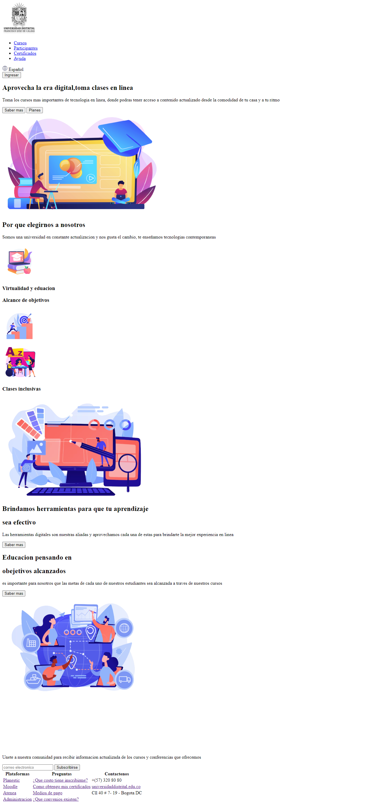

<h1>Taller 9 Diego Alejandro Cano Bautista</h1>

<h2> Información</h2>

Curso: full Stack Basico - Grupo 1

Profesor: Cristian Patiño

<h2> Punto 1: Link figma</h2>

<a href="https://www.figma.com/file/ChTd7MO4dZUJViLNuj76tX/Diego-Alejandro-Cano?type=design&node-id=0%3A1&mode=design&t=Qy4T4WU4NK9MD0G4-1" target="_blank">Link de Figma</a>

<h2>Punto 2: Diseño HTML </h2>
Punto 3: Diseño CSS</h2>

<h2>Punto 4: Titulos </h2>

<h2>Punto 5: Estilos de texto</h2>

<h2>Punto 6: Enlaces</h2>

<h2>Punto 7-8: Navegacion</h2>

<h2>Punto 9: Tablas</h2>
